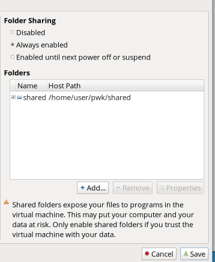
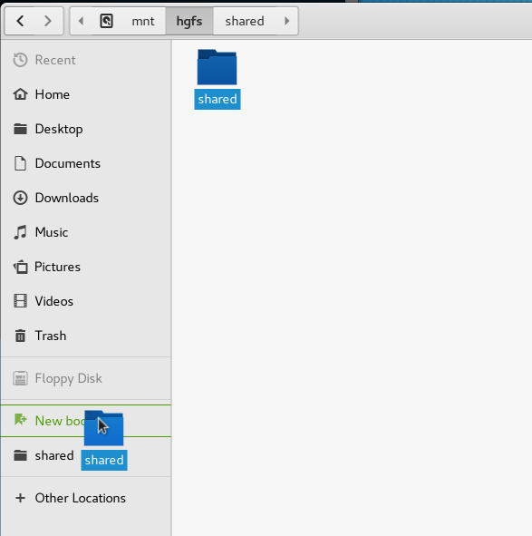

# PWK Getting Started

Here's a guide that you may find helpful to get up and running quickly on the Pentesting with Kali course.

### Your PWK ID

After enrolling in the PWK course for the first time, you'll be assigned an OS number, which will look something like "OS-13245".  You'll also be assigned a password, which will be random and unchangeable.  When accessing the lab, the forums, or IRC, you'll generally use your OS number as your username.  

## Up and Running

This section covers the basics you need to get your VM downloaded, configured, and connected.  It includes a few configuration settings that may make your life easier.

### Your materials
You'll recieve a number of materials during the sign up process, including:
- Purchase Links
- Lab Connection Kit
- Materials
  - Training Guide
  - Training Videos

Save these materials to a safe location, then make an extra backup.  Getting additional copies of these materials requires support from OffSec, additional fees, or both.

### Starting the VM

First things first, you'll need the lab VM and some form of virtual machine host.  For most of us, this will likely be [VMware Player](https://www.vmware.com/products/player/playerpro-evaluation.html).  If you have ESXi, feel free to use it, but some of the quality of life items in the later sections may not apply.  

Next you'll need the Kali VM.  It's entirely possible to run the lab from the public Kali VM image, but you'll have better luck with the class-specific release found [here](https://support.offensive-security.com/#!pwk-kali-vm.md). 

**Note!** Resist the urge to update your Kali VM.  The class doesn't need it, and the latest updates can sometimes cause the specific instructions in the lab to be obsolete.  If you *do* update, understand that you may need to do additional research in some instances.  Read the note about updating [here](https://support.offensive-security.com/#!pwk-kali-vm.md#Updating_the_PWK_VM) for more details.


### Connecting to the Lab

You can access your VM using the default credentials `root` and `toor`.  Before connecting to the lab, **change your password!**  Fire up a terminal, and use `passwd` to change the root password.

You'll want to enable copy/paste between the guest VM and your host.  I also create a shared folder between the two systems for notes and simple file transfers.  However you want to do it, copy the lab-connection.bz2 to your guest VM.

Extract the connection files:
```bash
tar xvjf lab-connection.bz2
```

Test the connection with:
```bash
openvpn OS-XXXXX-PWK.ovpn
```

### Quality of Life
Here's a few helpful configuration steps that may make your life easier. Purely optional, so feel free to ignore or customize as you see fit. 

#### Copy/Pasting
This isn't a configuration step as much as a quick tip.  To copy/paste into and out of the Kali terminal, you'll want to add `SHIFT` to your usual shortcuts.  

- Copy: `Ctrl+Shift+C`
- Paste: `Ctrl+Shift+V`

#### Shared Folders
I like to use shared folders to easily transfer information in and out of the Kali VM.  I also store my notes in the shared folder so I can easily edit them from in either environment.  

You'll want to configure a suitable folder on your host system, then enable and configure shared folders in VMWare.  From **Virtual Machine Settings> Options tab>Shared Folders**, configure things like this:


From within the guest VM, use the `mount-shared-folders.sh` script on the desktop to mount your new drive.  The folder is located at `/mnt/hgfs/`, which isn't the most user friendly location.  I linked it to my home directory, so it's accessible as `~/shared`:

```bash
root@kali:~# ln -s /mnt/hgfs/shared/ /root/shared
```

You may also add it as a shortcut in the GUI file browser by navigating to the folder and dragging it to the *Add Shortcut* button.:



Lastly, to mount the folder automatically each time you sign in, link `mount-shared-folders.sh` to `/etc/profile.d` like so.

```bash
root@kali:~# ln -s /root/Desktop/mount-shared-folders.sh /etc/profile.d/
```

#### Easier VPN Access
Typing out the full VPN connection command prior to each session can be awkward, and entering the random password is a bit of a pain too.  While saving passwords is generally a 'bad idea', this shouldn't introduce too much risk.

First, make a copy of your VPN file.  You might name it something like `OS-XXXX-PWK.ovpn.bak`, but I named mine `offsec.ovpn` for simplicity.  Next, create a new file (I called mine `credentials.txt`).  The file should have two lines.  The first line is your username (probably your `OS-XXXX` identifier).  The second line is your assigned VPN password.  We're do care at least a little about security, so restrict permissions on the file:

```bash
$ chmod 600 ~/credentials.txt
```

Then, edit your `ovpn` file, and change the line:

```
auth-user-pass
```

to now read:

```
auth-user-pass ~/credentials.txt
```

Test your new connection, no password needed:

```bash
root@kali:~# openvpn ~/offsec.ovpn
```

*Extra credit:*  Are you extra lazy?  Don't like to leave a terminal open to run the VPN?  Configure aliases to connect and disconnect with one command each.

```bash
root@kali:~# echo alias connect=\"openvpn /root/offsec.ovpn&\" >> ~/.bash_aliases
root@kali:~# echo alias disconnect=\"killall openvpn\" >> ~/.bash_aliases
```

#### Easier RDP Access
A lot of the lab involves accessing your personal Windows 7 system via RDP.  The system has to be booted via the Student Control Panel first, but you can condense your connection command down to `rdp` with this:

```bash
root@kali:~# echo alias rdp=\"rdesktop -u **user** -p **password** 10.X.X.X\"
```

## Reporting

You're required to present a professional-style report of your test findings as part of passing the OSCP test.  You're strongly recommended to also submit your lab notes and a lab report as well, which may be considered positively when the OffSec team evaluates borderline test scores.

OffSec provides recommended report templates in .doc and .odt formats [here](https://forums.offensive-security.com/showthread.php?t=2225).  You're allowed to deviate from those templates if you want, but you'll want to be sure to include these items, regardless of format.

> You can use your own template as long as it contains the steps to reproduce the exploits, the references to the PoC used along with any changes and screenshots to prove the access gained. You can send this in a pdf, doc or odt format and present it in a professional and organized manner which allows us test and reproduce the exploits step by step.
[Reference](https://forums.offensive-security.com/showthread.php?t=2225&p=12065#post12065)

The OffSec guys have a page with more reporting details [here](https://support.offensive-security.com/#!pwk-reporting.md).

Also note, when you're submitting lab notes, these sections may be omitted:
- Finding Your Way Around Kali
- Managing Kali Linux Services
- Netcat
- Searching for Exploits
- File Transfer Methods
- Know Your Target
- Password Mutating
- Bypassing Antivirus Software

## Where to get Help


